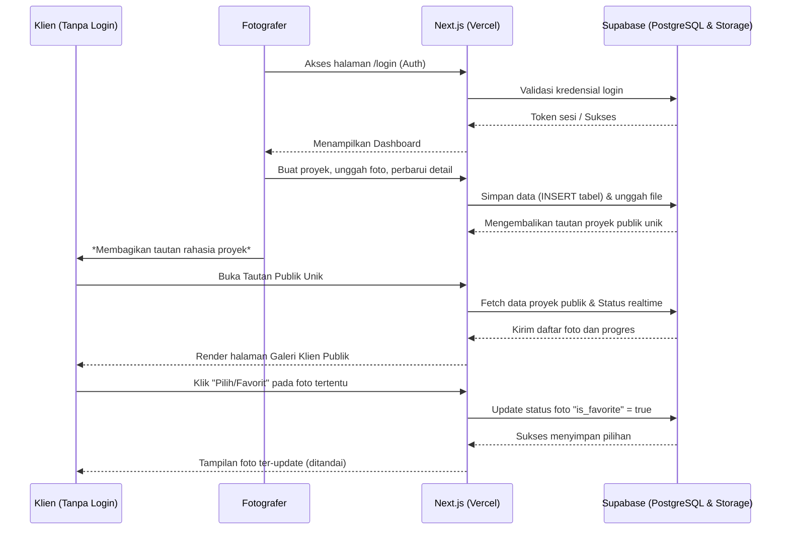
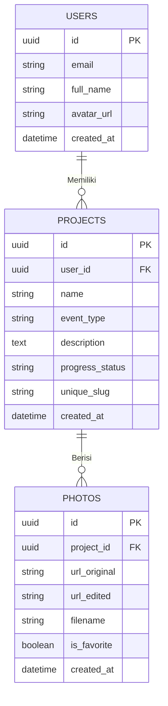

# PRD — Project Requirements Document

## 1. Overview
Proses pascaproduksi dalam fotografi, khususnya tahapan kurasi dan pemilihan foto oleh klien (client proofing), sering kali sangat tidak efisien. Mengirimkan tautan Google Drive standar menurunkan kesan profesional, sementara metode pemilihan manual via WhatsApp—di mana klien mengetik nama file satu per satu—sangat rentan terhadap typo dan melambatkan alur kerja. Klien juga sering merasa kesulitan melacak sejauh mana progress pengerjaan proyek foto mereka (Wedding, Graduation, dll). 

Aplikasi SaaS **"Client Gallery & Proofing Platform"** hadir untuk memecahkan masalah tersebut. Melalui platform yang modern, minimalis, dan responsif, fotografer dapat mengelola proyek dengan mudah. Sistem akan membuat tautan galeri publik khusus secara otomatis untuk klien. Klien dapat masuk tanpa perlu login, melihat status pengerjaan secara *real-time*, membandingkan foto sebelum dan sesudah diedit, serta memilih (menyukai) foto final cukup dengan satu klik. Platform ini tidak hanya menaikkan nilai profesionalisme fotografer, tetapi juga menghemat waktu dan meningkatkan kepuasan pelanggan secara signifikan.

## 2. Requirements
- **Aksesibilitas & Penilaian:** Seluruh fitur dalam aplikasi harus berstatus *open* (tidak ada fitur yang dikunci/paywall) sebagai syarat penilaian.
- **Responsivitas:** Antarmuka harus nyaman dan dapat digunakan secara optimal baik di perangkat desktop, tablet, maupun mobile.
- **Akses Klien Tanpa Login:** Klien harus dapat mengakses galeri dan memilih foto hanya melalui Tautan Publik Unik tanpa harus membuat akun atau mengingat kata sandi.
- **Pembaruan Real-Time:** Perubahan status pengerjaan oleh fotografer harus segera terefleksikan dan dapat dilihat oleh klien di halaman publik proyek tersebut.
- **Deployment & Infrastruktur:** Menggunakan platform cloud modern (Vercel untuk Frontend, Supabase untuk Backend/Database dan Storage).

## 3. Core Features
Fitur-fitur utama dirancang berdasarkan kerangka *roadmap* yang dikembangkan dalam empat fase pengembangan utama:

**Fase 1: Dashboard Proyek**
- **Daftar Proyek:** Halaman beranda fotografer untuk melihat semua proyek yang sudah berjalan, status saat ini, dan tautan ringkasnya.
- **Buat Proyek Baru:** Form sederhana untuk menambahkan detail awal proyek klien (Nama Klien, Jenis Acara, Deskripsi, dll).
- **Status Proyek Sekilas:** Setiap kartu/baris proyek pada dashboard menampilkan indikator visual yang menunjukkan tahap proyek tersebut berada.

**Fase 2: Manajemen Proyek**
- **Unggah Foto:** Akses bagi fotografer untuk mengunggah kumpulan file foto mentah atau hasil yang perlu di-kurasi.
- **Kelola Detail Proyek:** Menyesuaikan deskripsi, nama, atau pengaturan proyek kapan saja.
- **Tautan Galeri Unik:** Generator untuk membuat dan menyalin URL rahasia proyek yang ditujukan untuk klien.
- **Pratinjau Galeri:** Tombol bagi fotografer untuk melihat galeri seolah-olah mereka adalah klien.
- **Pengaturan Progress:** Menu untuk mengubah tahapan proses kerja yang disepakati (misal: "Proses Edit", "Menunggu Reviu", "Selesai").

**Fase 3: Galeri Klien Publik**
- **Telusuri Galeri Foto:** Tampilan galeri foto bagi klien yang bersih, memukau, dan *loading* dengan cepat. 
- **Indikator Tahap Pengerjaan:** Bar informasi di atas galeri klien yang mendeskripsikan sedang di tahap manakah proses foto tersebut.
- **Pilih Foto Favorit:** Fungsi "satu kali klik" (ikon *heart/check*) bagi klien untuk memilih dan menyimpan preferensi foto tanpa harus mendaftar.
- **Perbandingan Sebelum-Sesudah:** Slider/Toggle khusus untuk membandingkan gaya pratinjau suatu foto mentah berbanding foto yang sudah diberikan filter awal/edit.

**Fase 4: Autentikasi & Akun**
- **Daftar Akun:** Registrasi fotografer ke dalam SaaS agar datanya tertaut dan aman (Sign Up).
- **Login & Logout:** Akses otorisasi bagi fotografer terdaftar untuk kembali mengurus proyek *(Sign In / Sign Out)*.
- **Reset Password:** Alur keamanan akun guna memulihkan akses kata sandi fotografer.
- **Pengaturan Profil:** Konfigurasi dasar untuk mengubah nama, email kontak, dan avatar personalisasi fotografer.

## 4. User Flow

**Alur Fotografer (Pemilik Proyek):**
1. Datang ke halaman utama aplikasi dan melakukan **Login** atau **Daftar Akun** baru.
2. Masuk ke **Dashboard Proyek**, melihat ringkasan proyek, lalu klik **Buat Proyek Baru**.
3. Di halaman **Manajemen Proyek**, fotografer mengisi detail, lalu mengunggah koleksi foto klien.
4. Menyesuaikan **Pengaturan Progress** (misalnya menjadi "Tahap Kurasi Klien").
5. Menyalin **Tautan Galeri Unik** dan membagikannya ke klien via platform pesan (misal: WhatsApp).
6. Kembali ke dashboard secara berkala untuk memantau foto-foto yang telah di-"favoritkan" oleh klien.

**Alur Klien (Pengguna Publik):**
1. Mengklik URL unik yang dikirimkan oleh fotografer (bisa dibuka lewat smartphone maupun PC).
2. Tiba di **Galeri Klien Publik** tanpa perlu input form login apa pun. 
3. Melihat bar **Indikator Tahap Pengerjaan** ("Status: Kurasi Klien") di bagian atas.
4. Menjelajahi galeri dengan mencoba **Perbandingan Sebelum-Sesudah** jika fitur tersebut dinyalakan oleh fotografer.
5. Melakukan scroll dan menandai foto yang ia inginkan melalui fitur **Pilih Foto Favorit** (klik ikon). Pilihan akan otomatis tersimpan dalam sistem.
6. Menginformasikan fotografer setelah seluruh foto yang diminati selesai dipilih.

## 5. Architecture
Sistem menggunakan pendekatan *Modern Web App* dengan arsitektur serverless dimana Frontend dan fungsi-fungsi perantara ditangani secara terpadu oleh Next.js pada Vercel. Supabase digunakan sebagai Basis Data, *Authentication*, sekaligus media penyimpan gambar foto proyek (*Cloud Storage*). 

## 6. Database Schema
Aplikasi ini hanya membutuhkan tabel fundamental untuk mengelola proyek fotografi beserta file foto di dalam setiap proyek. Struktur tabel Relasional menggunakan integrasi ke Supabase Database yang berbasis PostgreSQL.

**Penjelasan Tabel:**
1. **USERS**: Skema untuk menyimpan data fotografer (diintegrasikan otomatis dengan *Supabase Auth*).
   - `id`: *Primary Key* unik (UUID pengidentifikasi fotografer).
   - `email`: Alamat surel fotografer.
   - `full_name`: Nama tampilan fotografer.
   - `created_at`: Waktu pendaftaran.

2. **PROJECTS**: Menyimpan informasi setiap sesi foto klien.
   - `id`: *Primary Key* unik proyek.
   - `user_id`: Fotografer pemilik proyek (*Foreign Key* ke tabel Users).
   - `name`: Nama klien atau nama proyek (contoh: "Prewedding Andi & Budi").
   - `progress_status`: Posisi pengerjaan (contoh: 'Uploading', 'Client Proofing', 'Editing', 'Done').
   - `unique_slug`: String acak yang di-generate sistem/frontend dan akan menjadi *path url rahasia*.

3. **PHOTOS**: Menyimpan metadata untuk setiap foto dalam satu proyek.
   - `id`: *Primary Key* tipe UUID setiap foto.
   - `project_id`: *Foreign Key* merujuk ke tabel PROJECTS tempat bernaung.
   - `url_original`: Tautan foto awal dari *Supabase Storage* tempat gambar disimpan (Mentah).
   - `url_edited`: (Opsional) Tautan foto yang telah diproses untuk perbandingan fitur *Before-After*.
   - `is_favorite`: Status logikal (*boolean*), di-klik klien menjadi `true` sebagai tanda setuju/suka.

## 7. Tech Stack
Aplikasi akan berfokus pada teknologi mutakhir yang memungkinkan produktivitas tinggi (*serverless*) serta integrasi instan dengan Supabase, sebagaimana permintaan pengguna:

- **Frontend & Routing:** [Next.js (App Router)](https://nextjs.org/) — Menangani komponen *React*, Server-Side Rendering (SSR), serta halaman utama dan galeri cepat.
- **Styling & UI:** [Tailwind CSS](https://tailwindcss.com/) bersama dengan [shadcn/ui](https://ui.shadcn.com/) — Untuk desain halaman (*dashboard* & *gallery*) yang sangat *clean*, siap pakai, responsif dan minimalis.
- **Backend & Database:** [Supabase](https://supabase.com/) — Memanfaatkan *PostgreSQL Database*, *Supabase Storage* (sebagai penyimpanan *blob* file mentah foto), serta *Supabase Auth* (Authentication) untuk manajemen sesi fotografer.
- **Deployment Platform:** [Vercel](https://vercel.com/) — Digunakan untuk meluncurkan aplikasi dengan skalabilitas tanpa batas, memuat peretasan *edge network* yang membuatnya sangat cepat diakses dari mana saja saat fotografer share tautan ke klien.